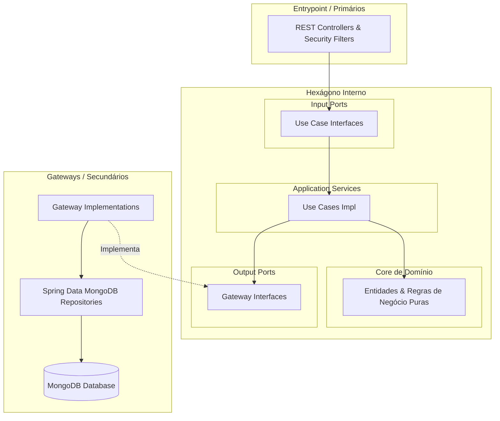

# 💌 Convite Backend — Sistema de Gestão de Convites, RSVP e Portaria de Casamento

[](https://www.oracle.com/java/)
[](https://spring.io/projects/spring-boot)
[](https://www.mongodb.com/)
[](#-arquitetura-hexagonal)
[](LICENSE)

Backend robusto, moderno e altamente resiliente desenvolvido com **Spring Boot 3** e **Java 21**, projetado sob os rigorosos preceitos da **Arquitetura Hexagonal (Ports and Adapters)**, **Domain-Driven Design (DDD)** e **Clean Architecture**.

O sistema gerencia de ponta a ponta o ciclo de vida dos convites de casamento: distribuição de códigos exclusivos, confirmação individual de presença (RSVP nominal com suporte a crianças até 6 anos), portaria e check-in nominal com QR Code, sincronização recíproca de pares no cortejo, credenciamento de fornecedores e controle do cerimonial.

---

## 🏛️ Arquitetura Hexagonal (Ports and Adapters)

O sistema adota uma arquitetura em que o **núcleo de negócios (Domain e Use Cases)** é completamente independente de frameworks, protocolos HTTP, bancos de dados e interfaces externas.



### Regra de Dependência Rigorosa (Outside-In):
- **Domain (`br.com.convite.domain`)**: Contém entidades puras (`Convite`, `MembroConvite`, `ParticipanteCerimonia`, `Fornecedor`, `PapelParticipante`, `VinculoParticipante`, `MetricasCasamento`). Não possui dependências de Spring, JPA ou HTTP.
- **Use Cases (`br.com.convite.usecase`)**: Casos de uso especializados com interfaces segregadas e comandos de aplicação (`Comando`, `Records`). Zero acoplamento com classes da camada `entrypoint`.
- **Gateways (`br.com.convite.gateway`)**: Output Ports declarados como interfaces no core e implementados em `gateway.impl`, isolando as entidades MongoDB (`persistence.entity`) das entidades de domínio através de mappers bidirecionais.
- **Entrypoint (`br.com.convite.entrypoint.api`)**: Driving Adapters compostos por REST Controllers que mapeiam requisições JSON para DTOs, invocam os Use Cases e formatam respostas HTTP semânticas.

---

## ✨ Funcionalidades Principais

1. **Gestão de Convites & Famílias:**
   - Criação e manutenção de convites com código alfanumérico único gerado com entropia criptográfica (`SecureRandom`).
   - Múltiplos membros por família com identificadores únicos persistidos (`UUID`).
   - Identificação de crianças de 0 a 6 anos (com assentos e contagens gerenciais segregadas).
   - Busca inteligente e segura por código, família ou membros via MongoDB com escape de regex.

2. **RSVP Nominal Inteligente:**
   - Confirmação de presença nominal com escolha granular por membro.
   - Sincronização automática e recíproca com a lista de cortejo cerimonial e equipes de fornecedores.
   - Normalização e validação de telefones com suporte a formato internacional e DDD nacional.

3. **Sincronização Bilateral de Pares do Cortejo:**
   - Ao vincular o Par A ao Par B, o sistema atualiza reciprocamente e de forma atômica o convite do Par B.
   - Ao desvincular ou alterar o par, a limpeza do par anterior ocorre bilateralmente sem intervenção manual.

4. **Portaria, Check-in e Reversão em Cascata:**
   - Registro nominal de entrada por membro com timestamp e identificação do operador de portaria.
   - Bloqueio rigoroso de duplicidade quando convidados já ingressaram no evento.
   - **Reversão Total de Check-in em Cascata**: Reverte o status do convite e seus membros, propagando automaticamente a ausência para o Cerimonial/Cortejo (`AGUARDANDO_CHEGADA`) e Fornecedores.
   - Relatório de auditoria em tempo real (previstos, confirmados, presentes reais, ausentes no-show).

5. **Autenticação Avançada com Refresh Token & Rotação:**
   - Emissão de Access Tokens JWT de curta duração (15 minutos) e Refresh Tokens persistidos com rotação obrigatória.
   - Detecção e bloqueio de tentativas de reutilização maliciosa de tokens de atualização revogados.
   - Endpoints dedicados para renovação de sessão (`/api/auth/refresh`), logout pontual e logout de todas as sessões ativas (`/api/auth/logout-all`).

6. **Credenciamento de Fornecedores & Equipe:**
   - Cadastro e gestão de empresas fornecedoras (Buffet, Fotografia, Decoração, Cerimonial, Som/DJ).
   - Controle de crachá virtual e presença individual da equipe técnica na portaria de serviço.

---

## 🛠️ Tecnologias Utilizadas

- **Linguagem:** Java 21 (LTS)
- **Framework:** Spring Boot 3.3.4
- **Módulos Spring:**
  - Spring Boot Starter Web
  - Spring Boot Starter Data MongoDB
  - Spring Boot Starter Security
  - Spring Boot Starter Validation
- **Segurança:** JJWT (`io.jsonwebtoken:jjwt-api:0.12.6`), BCryptPasswordEncoder
- **Persistência:** Spring Data MongoDB com índices compostos e mapeamento de entidades
- **Produtividade:** Project Lombok
- **Testes:** JUnit 5, Mockito, AssertJ

---

## 🚀 Como Executar

### Pré-requisitos
- JDK 21+ instalado e configurado no `PATH`
- MongoDB em execução (localmente ou via Docker/Atlas)
- Apache Maven 3.9+ instalado (ou utilize o wrapper `./mvnw`)

### 1. Clonar e Acessar o Projeto
```bash
git clone https://github.com/thiagovscode/convite-backend-v2.git
cd convite-backend-v2
```

### 2. Executar os Testes Unitários
```bash
mvn test
```

### 3. Gerar o Pacote JAR Executável
```bash
mvn clean package -DskipTests
```
O arquivo executável será gerado em `target/convite-backend-0.0.1-SNAPSHOT.jar`.

### 4. Executar a Aplicação
```bash
# Executando via Maven
mvn spring-boot:run

# OU executando diretamente o JAR gerado
java -jar target/convite-backend-0.0.1-SNAPSHOT.jar
```

A aplicação iniciará na porta **`8080`**:
- URL Base: `http://localhost:8080`

---

## 📖 Endpoints da API REST

### 🎟️ Públicos (Convidados e RSVP)
| Método | Endpoint | Descrição |
| :--- | :--- | :--- |
| `GET` | `/api/convites/{codigo}` | Busca os detalhes completos de um convite pelo código |
| `POST` | `/api/rsvp/casamento` | Confirma ou recusa presença nominal com seleção de membros |
| `GET` | `/api/classificacoes` | Consulta pública de papéis e vínculos disponíveis |
| `GET` | `/api/configuracao-evento` | Consulta pública do prazo limite de confirmação do RSVP |

### 🔐 Autenticação, Sessão e Refresh Token
| Método | Endpoint | Descrição |
| :--- | :--- | :--- |
| `POST` | `/api/auth/login` | Login administrativo com emissão de Access Token e Refresh Token |
| `POST` | `/api/auth/refresh` | Renovação transparente de Access Token com rotação de Refresh Token |
| `POST` | `/api/auth/logout` | Revoga o Refresh Token ativo |
| `POST` | `/api/auth/logout-all` | Encerra todas as sessões ativas do usuário |
| `POST` | `/api/recepcao/login` | Login da equipe de portaria/recepção |
| `GET` | `/api/recepcao/validar-sessao` | Valida token ativo da recepção |

### 🚪 Recepção & Portaria (Check-in ao Vivo)
| Método | Endpoint | Descrição |
| :--- | :--- | :--- |
| `GET` | `/api/recepcao/busca?termo={termo}` | Busca nominal rápida de convidados na portaria |
| `POST` | `/api/recepcao/checkin` | Registra check-in nominal por membro |
| `POST` | `/api/recepcao/checkin/{codigo}/reverter` | Reverte check-in em cascata (convite, cortejo e fornecedor) |
| `GET` | `/api/recepcao/auditoria` | Relatório consolidado em tempo real de presença |
| `GET` | `/api/recepcao/participantes` | Lista participantes do cortejo e status |
| `POST` | `/api/recepcao/participantes/{id}/checkin` | Atualiza presença/status de membro do cortejo |
| `GET` | `/api/recepcao/fornecedores` | Lista fornecedores e membros de equipe |
| `POST` | `/api/recepcao/fornecedores/{fId}/membros/{mId}/checkin` | Check-in individual de membro de fornecedor |

### ⚙️ Administração Geral (`/api/admin/*`)
| Método | Endpoint | Descrição |
| :--- | :--- | :--- |
| `GET` | `/api/admin/convites` | Lista todos os convites (com suporte a paginação) |
| `POST` | `/api/admin/convites` | Cadastra novo convite |
| `PUT` | `/api/admin/convites/{codigoOuId}` | Atualiza convite existente preservando identificadores |
| `PUT` | `/api/admin/convites/definir-par` | Define par de cortejo com sincronização recíproca bilateral |
| `DELETE` | `/api/admin/convites/{id}` | Exclui convite |
| `POST` | `/api/admin/convites/{id}/resetar-rsvp` | Reseta convite para PENDENTE e remove registros de RSVP |
| `GET` | `/api/admin/convites/metricas` | Dashboard analítico com taxas e contagens consolidadas |
| `GET` | `/api/admin/rsvp/casamento` | Relatório analítico detalhado das confirmações |
| `GET` | `/api/admin/fornecedores` | Listagem e gerenciamento de fornecedores |
| `PUT` | `/api/admin/fornecedores/{fId}/membros/{mId}` | Atualização de membro de equipe de fornecedor |
| `PUT` | `/api/admin/configuracao-evento` | Atualiza o prazo de encerramento do RSVP |

---

## 🧪 Estratégia de Testes

Os testes automatizados cobrem a lógica central de domínio, regras de negócio e use cases com **40 testes unitários**:
- `AutenticacaoRefreshTokenTest`: Rotação de refresh token, detecção de reúso malicioso, expiração e revogação.
- `DefinirParCortejoUseCaseTest`: Vinculação recíproca bilateral e desvinculação limpa de pares.
- `ReverterCheckinConvidadoUseCaseTest`: Reversão de check-in e propagação em cascata para cortejo e equipes.
- `RegistrarCheckinConvidadoUseCaseTest`: Validações de entrada, duplicidade e escopo de membros.
- `CalcularMetricasCasamentoUseCaseTest`: Percentuais exatos com soma 100% e segregação de adultos e crianças.
- `ProcessarConfirmacaoRsvpCasamentoUseCaseTest`: Validações de confirmação individual, homônimos e idempotência.
- `BuscarConvitePorCodigoUseCaseTest`: Resolução de códigos e fallback seguro.
- `HierarquiaBuscaConviteConvidadoTest`: Prioridade e assertividade de buscas nominais.

Execute a suíte de testes:
```bash
mvn test
```
