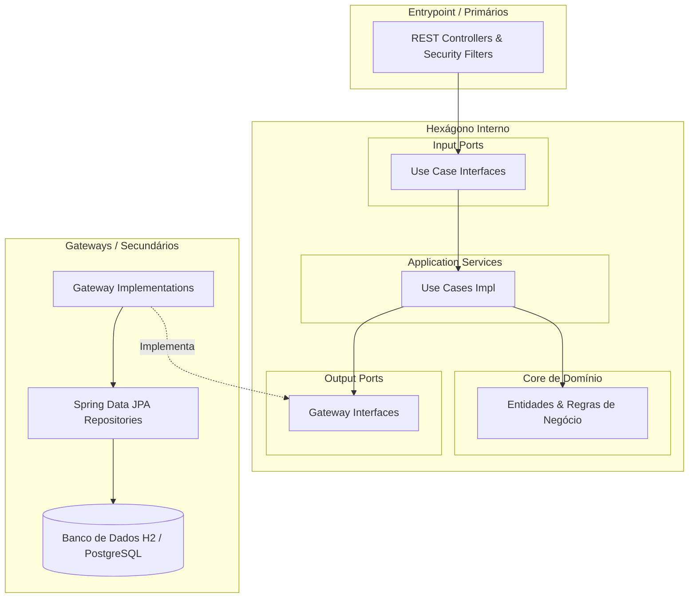

# 💌 Convite Backend — Sistema de Gestão de Convites, RSVP e Portaria de Casamento

[](https://www.oracle.com/java/)
[](https://spring.io/projects/spring-boot)
[](#arquitetura-hexagonal)
[](LICENSE)

Backend robusto, moderno e resiliente desenvolvido com **Spring Boot 3** e **Java 21**, projetado sob os rigorosos preceitos da **Arquitetura Hexagonal (Ports and Adapters)**, **Domain-Driven Design (DDD)** e **Clean Architecture**.

O sistema gerencia de ponta a ponta o ciclo de vida dos convites de casamento: distribuição de códigos exclusivos, confirmação individual de presença (RSVP nominal com suporte a acompanhantes e crianças até 6 anos), recepção e check-in nominal por QR Code na portaria, credenciamento de fornecedores e controle do cortejo cerimonial.

---

## 🏛️ Arquitetura Hexagonal (Ports and Adapters)

O backend adota uma arquitetura em que o **núcleo de negócios (Domain e Use Cases)** é completamente independente de frameworks, protocolos HTTP, bancos de dados e interfaces externas.



### Regra de Dependência Rigorosa (Outside-In):
- **Domain (`br.com.convite.domain`)**: Contém entidades puras (`Convite`, `MembroConvite`, `ParticipanteCerimonia`, `FornecedorCasamento`, `PapelParticipante`, `VinculoParticipante`, `MetricasCasamento`). Não possui dependências de Spring, JPA ou HTTP.
- **Use Cases (`br.com.convite.usecase`)**: Casos de uso especializados com interfaces segregadas e comandos de aplicação (`Comando`, `Records`). **Zero acoplamento** com classes da camada `entrypoint`.
- **Gateways (`br.com.convite.gateway`)**: Output Ports declarados como interfaces no core e implementados em `gateway.impl`, isolando as entidades JPA (`persistence.entity`) das entidades de domínio através de mappers bidirecionais.
- **Entrypoint (`br.com.convite.entrypoint.api`)**: Driving Adapters compostos por REST Controllers que mapeiam requisições JSON para DTOs do entrypoint, invocam os Use Cases e formatam as respostas HTTP.

---

## ✨ Funcionalidades Principais

1. **Gestão de Convites & Famílias:**
   - Criação e manutenção de convites com código alfanumérico único.
   - Suporte a múltiplos membros por família, com classificação de titular, papel e vínculo.
   - Identificação de crianças de 0 a 6 anos (com assentos e contagens gerenciais diferenciadas).
   - Busca inteligente por código, nome da família ou nome de qualquer membro.

2. **RSVP Nominal Inteligente:**
   - Confirmação de presença nominal com escolha granular por membro.
   - Desambiguação segura de membros homônimos via identificadores únicos.
   - Proteção estrita contra confirmações duplicadas.
   - Sincronização automática com a lista de cortejo cerimonial e fornecedores.

3. **Portaria & Check-in ao Vivo:**
   - Leitura rápida de QR Code ou busca por código/nome na portaria.
   - Registro nominal de entrada por membro com timestamp e identificação do recepcionista.
   - Bloqueio de duplicidade quando convidados já ingressaram no evento.
   - Relatório de auditoria em tempo real (previstos, confirmados, presentes reais, ausentes no-show).

4. **Gestão Segregada de Papéis e Vínculos:**
   - Casos de uso totalmente independentes para customização de papéis (Noivo, Noiva, Padrinho, Dama de Honra, etc.) e vínculos (Família, Amigos, Trabalho).

5. **Credenciamento de Fornecedores & Equipe:**
   - Cadastro de empresas fornecedoras (Buffet, Fotografia, Decoração, etc.).
   - Gestão de membros da equipe de trabalho com crachá e controle de check-in na portaria de serviço.

6. **Segurança & Tratamento de Erros:**
   - Autenticação stateless via Spring Security com tokens JWT.
   - Tratamento centralizado de exceções via `RestExceptionHandler` com códigos HTTP semânticos (400, 401, 404, 409) e propagação limpa de mensagens de negócio.

---

## 🛠️ Tecnologias Utilizadas

- **Linguagem:** Java 21 (LTS)
- **Framework:** Spring Boot 3.3.4
- **Módulos Spring:**
  - Spring Boot Starter Web
  - Spring Boot Starter Data JPA
  - Spring Boot Starter Security
  - Spring Boot Starter Validation
- **Segurança:** JJWT (`io.jsonwebtoken:jjwt-api:0.12.6`)
- **Persistência:** Hibernate / JPA com Banco H2 em memória (facilmente intercambiável via `application.properties`)
- **Produtividade:** Project Lombok
- **Testes:** JUnit 5, Mockito, AssertJ

---

## 🚀 Como Executar

### Pré-requisitos
- JDK 21+ instalado e configurado no `PATH`
- Apache Maven 3.9+ instalado (ou utilize o wrapper `./mvnw`)

### 1. Clonar e Acessar o Projeto
```bash
git clone https://github.com/thiagovscode/convite-backend-v2.git
cd convite-backend-v2
```

### 2. Executar os Testes Unitários e de Integração
```bash
mvn test
```

### 3. Gerar o Pacote JAR Executável
```bash
mvn clean package
```
O arquivo executável será gerado em `target/convite-backend-0.0.1-SNAPSHOT.jar`.

### 4. Executar a Aplicação
```bash
# Executando via Maven
mvn spring-boot:run

# OU executando diretamente o JAR gerado
java -jar target/convite-backend-0.0.1-SNAPSHOT.jar
```

A aplicação iniciará na porta padrão **`8080`**:
- URL Base: `http://localhost:8080`
- Console H2: `http://localhost:8080/h2-console` (JDBC URL: `jdbc:h2:mem:convitedb`, User: `sa`, Senha: em branco)

---

## 📖 Endpoints da API REST

### 🎟️ Públicos (Convidados e RSVP)
| Método | Endpoint | Descrição |
| :--- | :--- | :--- |
| `GET` | `/api/convites/codigo/{codigo}` | Busca os detalhes de um convite pelo código |
| `POST` | `/api/convites/rsvp` | Confirma ou recusa presença nominal com membros |
| `GET` | `/api/classificacoes` | Obtém papéis e vínculos disponíveis |

### 🔐 Autenticação & Sessão
| Método | Endpoint | Descrição |
| :--- | :--- | :--- |
| `POST` | `/api/recepcao/login` | Autentica recepcionista/administrador e emite JWT |
| `GET` | `/api/recepcao/validar-sessao` | Valida validade do token JWT ativo |

### 🚪 Recepção & Portaria (Check-in)
| Método | Endpoint | Descrição |
| :--- | :--- | :--- |
| `GET` | `/api/recepcao/convite/{codigo}` | Consulta convite por código na portaria |
| `GET` | `/api/recepcao/busca?termo={termo}` | Busca nominal rápida de convidados na portaria |
| `POST` | `/api/recepcao/checkin` | Registra check-in nominal dos membros da família |
| `GET` | `/api/recepcao/auditoria` | Relatório consolidado em tempo real de presença |
| `GET` | `/api/recepcao/participantes` | Lista participantes do cortejo e status |
| `POST` | `/api/recepcao/participantes/{id}/checkin` | Atualiza presença/status de membro do cortejo |

### ⚙️ Administração Geral (`/api/admin/*`)
| Método | Endpoint | Descrição |
| :--- | :--- | :--- |
| `GET` | `/api/admin/convites` | Lista todos os convites cadastrados |
| `POST` | `/api/admin/convites` | Cria ou atualiza convite e membros |
| `DELETE` | `/api/admin/convites/{id}` | Remove convite |
| `GET` | `/api/admin/convites/metricas` | Dashboard de métricas executivas do evento |
| `GET` | `/api/admin/rsvp/casamento` | Relatório analítico de respostas de RSVP |
| `GET` | `/api/admin/fornecedores` | Gestão de fornecedores e equipes de serviço |
| `GET` | `/api/admin/configuracoes/papeis` | Gerenciamento de papéis de convidados |
| `GET` | `/api/admin/configuracoes/vinculos` | Gerenciamento de vínculos de convidados |

---

## 🧪 Estratégia de Testes

Os testes automatizados cobrem a lógica central de domínio e use cases sem depender de contexto pesado de banco de dados ou servlets:
- `BuscarConvitePorCodigoUseCaseTest`: Resolução de convites e validações de inexistência.
- `CalcularMetricasCasamentoUseCaseTest`: Cálculo de percentuais, presença, contagem segregada de adultos e crianças.
- `ProcessarConfirmacaoRsvpCasamentoUseCaseTest`: Validações de confirmação individual, homônimos e idempotência.
- `RegistrarCheckinConvidadoUseCaseTest`: Regras de check-in, bloqueio de duplicidade e atribuição de portaria.

Execute os testes a qualquer momento com:
```bash
mvn test
```
